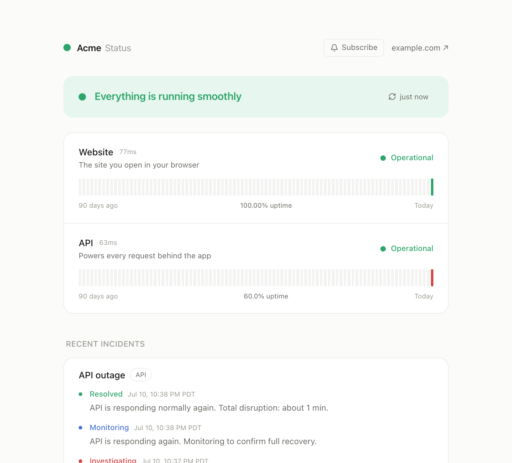

# status-page

A minimalist, self-hosted status page you can deploy in five minutes — free
on Vercel's hobby tier, no database required.

Built and battle-tested by [Clusy](https://clusy.io), where it runs
[status.clusy.io](https://status.clusy.io).

[](https://vercel.com/new/clone?repository-url=https%3A%2F%2Fgithub.com%2Fclusy-io%2Fstatus-page&project-name=status-page&repository-name=status-page&env=CRON_SECRET&envDescription=Protects%20the%20cron%20endpoint%20that%20records%20uptime%20history)

<picture>
  <source media="(prefers-color-scheme: dark)" srcset="docs/screenshot-dark.png">
  
</picture>

## What you get

- **Live health checks** — every service is probed server-side on each page
  load, and the page re-polls every 45 seconds. Visitors always see current
  reality, not a cached claim. Probe targets stay in server code, so internal
  hostnames and vendors are never exposed.
- **90-day uptime bars** — a cron records a daily up/total tally per service
  (optional; needs a free Vercel KV / Upstash store).
- **Auto-detected incidents** — a per-service state machine opens an incident
  after two consecutive failed probes ("investigating"), escalates if it
  worsens, and posts "resolved" after two consecutive healthy probes. Your
  incident timeline writes itself while you fight the fire.
- **Hand-curated incidents** — for anything the probes can't see (upstream
  degradations, post-mortems, maintenance windows), add an entry to a plain
  TypeScript file and push. No CMS.
- **Automatic notifications** — visitors can subscribe by email (double
  opt-in via Resend, one-click unsubscribe), and you can point Slack /
  Discord / generic webhooks at it. Every incident update — auto-detected or
  hand-written — is announced exactly once, on the next cron tick.
- **Calm, minimal UI** — monochrome surface where status colour is the only
  chroma; light + dark via `prefers-color-scheme`; respects
  `prefers-reduced-motion`.
- **Tiny footprint** — Next.js + Tailwind + one icon package. No tracking, no
  external services beyond what you configure.

## Quick start

1. Click **Deploy** above (or fork and import into Vercel).
2. Edit **`status.config.ts`** — your name, URLs, and the services to monitor:

   ```ts
   export const SITE = {
     name: "Acme",
     title: "Acme Status",
     url: "https://status.acme.com",
     homepage: "https://acme.com",
     // …
   };

   export const SERVICES: ServiceDef[] = [
     {
       id: "api",
       name: "API",
       description: "Powers every request behind the app",
       probe: httpProbe("https://api.acme.com/health"),
     },
     // …
   ];
   ```

3. Push. Vercel redeploys, and your status page is live.

Local development:

```bash
npm install
npm run dev        # http://localhost:3005
```

## Probes

Three helpers cover most setups (import from `@/lib/probes`):

| Helper | Use for |
|--------|---------|
| `httpProbe(url)` | Anything with a public URL. 2xx → operational, other response → degraded, timeout → down. |
| `dependencyProbe(url, name)` | Services that aren't publicly routable. Reads `dependencies.<name>` (or `checks.<name>`) from a JSON readiness endpoint you do expose. |
| `supabaseAuthProbe(base, anonKey?)` | A Supabase project, via its auth health endpoint. |

A probe is just `async () => ({ status, latencyMs })` — write your own for
anything else (TCP-ish checks via an edge endpoint, third-party status APIs,
…).

## Uptime history & auto incidents (optional)

Both need a KV store to persist across cron ticks — without one the page
still deploys and serves live status; it just can't remember yesterday.

1. In Vercel: **Storage → Create → Upstash for Redis (KV)**, link it to the
   project. Vercel injects `KV_REST_API_URL` + `KV_REST_API_TOKEN`
   automatically.
2. Set `CRON_SECRET` in the project env so the `/api/cron` endpoint (runs
   every 5 minutes, configured in `vercel.json`) can't be spammed to inflate
   history.

Storage cost is negligible: one small JSON document per service plus one for
incident state.

## Notifications (optional)

Incident updates can be pushed automatically. All channels are env-driven —
configure none, one, or all:

- **Email subscriptions** — set `RESEND_API_KEY` ([Resend](https://resend.com)
  free tier is plenty) and put a verified From address in
  `status.config.ts` → `NOTIFICATIONS.emailFrom`. A "Subscribe" button
  appears in the header; visitors get a confirmation email (double opt-in)
  and every notification carries a one-click unsubscribe link
  (`List-Unsubscribe` included). Needs KV (subscribers must persist).
  Use a subdomain for the From address so status mail can't hurt your
  primary domain's sending reputation.
- **Slack** — set `NOTIFY_SLACK_WEBHOOK_URL` to an incoming-webhook URL.
- **Discord** — set `NOTIFY_DISCORD_WEBHOOK_URL`.
- **Anything else** — set `NOTIFY_WEBHOOK_URL`; each update is POSTed as JSON
  (`{ site, url, incident, update }`).

What gets announced is controlled by `NOTIFICATIONS.levels` in
`status.config.ts` — by default `investigating`, `identified`, and
`resolved` (the intermediate "monitoring" step is skipped). A KV ledger
guarantees each update is announced exactly once, and on the very first tick
the ledger is seeded silently, so enabling notifications never replays your
incident history.

## Posting an incident by hand

Add an entry to `src/lib/incidents.ts` (newest first) and push:

```ts
{
  id: "2026-06-15-api-latency",
  title: "Elevated API latency",
  impact: "minor", // minor | major | critical | maintenance
  affected: ["api"],
  updates: [
    { at: "2026-06-15T14:40:00Z", level: "resolved",
      body: "Latency is back to normal. Root cause was a slow database query." },
    { at: "2026-06-15T14:05:00Z", level: "investigating",
      body: "We're seeing slower-than-usual API responses and are looking into it." },
  ],
},
```

Ongoing incidents (newest update isn't `resolved`) automatically pull the
headline banner and the affected service rows down — useful for degradations
an HTTP probe can't observe. A hand-written entry overrides an auto-detected
incident with the same id.

## Configuration reference

| Where | What |
|-------|------|
| `status.config.ts` | Branding (`SITE`), monitored services (`SERVICES`), and notification policy (`NOTIFICATIONS`). The only file most deployments touch. |
| `src/lib/incidents.ts` | Hand-curated incident history. |
| `src/app/globals.css` | Design tokens (colours, fonts) for light + dark. |
| `.env.example` | The few env vars: `CRON_SECRET`, KV credentials, notification channels, `STATUS_TIMEZONE`. |

To use your own logo, drop a file into `public/` and set `SITE.logo` (e.g.
`"/logo-mark.png"`). Without one, the header shows a live overall-status dot.

## License

[MIT](LICENSE) © [Clusy](https://clusy.io)
